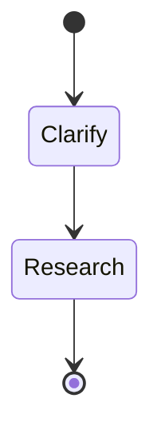
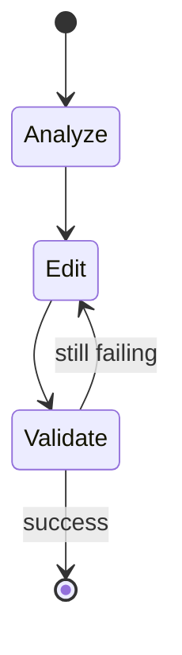
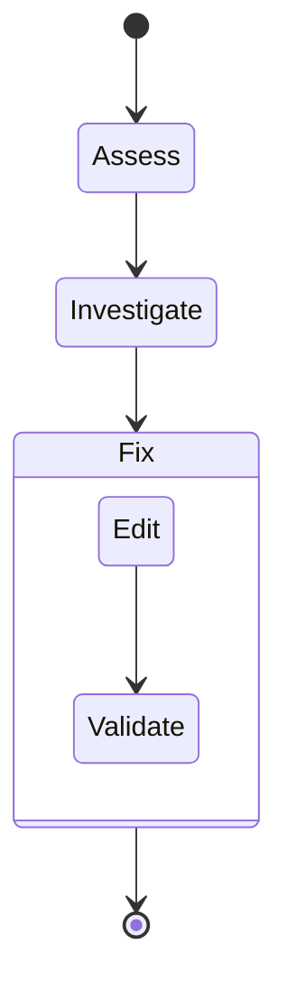

# Coding Agents

Coding agents for GitHub Copilot in VS Code, built on top of default agents.
Tested only with OpenAI-compatible API.

## Download

Put the agent Markdown files in:

- `.github/agents/` for repository-specific agents.
- `~/.copilot/agents/` for global agents.

## Agents

### Explain

A read-only agent with a tendency to show KaTeX math and Mermaid diagrams when
explaining technical concepts. Helpful to understand codebase of a new project.

### Maintain

Runs validation tasks and fixes issues that arise, one at a time. Suitable for
regression testing after changes have been made.

### Inspect

A long-running agent to find bugs in the codebase, creating a bug report for
escalation while giving the option to fix immediately. Pair with a frontier
model for best results.

## Usage

Switch between agents in `VSCode > Chat > Set Agent`.
